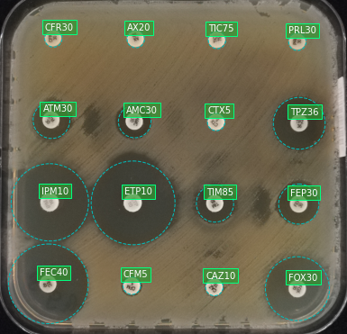

# AST image processing

## What is ASTimp?

AST image processing or _ASTimp_ allows the analysis of pictures of _disk diffusion AST_ plates and allows to measure the diameters of the inhibition zones. The picture should be acquired according to [this protocol](https://mpascucci.github.io/ASTapp-protocol/)


The library is written in C++. With the included Python wrapper, the library can be used in Python projects and notebooks.


## An example on Python notebooks


We have prepared a _Jupyter lab notebook_ to show ASTimp in action.
Find here the [HTML version of this notebook](ASTimp Quick Start with python.html)

The real notebook can be found in the `python module/jupyter-lab-example` folder.


## Getting the source code

The library can be downloaded from [Github](https://github.com/mpascucci/AST-image-processing).

Use the following command command to clone the repository:
```sh
git clone https://github.com/mpascucci/AST-image-processing.git
```

## Install

### Requirements
Building the library and the examples requires the following software installed on the system.
- OpenCV (>4.0.1)
- Cmake (>3.4.1)
- GTest

In Ubuntu, these dependencies correspond to the packages: `libopencv-dev`, `cmake` and `libgtest-dev`.

The Python wrapping module runs on Python3 (>3.6) and needs the openCV Python module installed (in Ubuntu the package name is `Python3-opencv`).

### Building the C++ library
Instructions for Linux/mac

Download the source code, then `cd` to the root folder `AST-image-processing`.

Either run the `run-build.sh` script which will build everything, or compile as explained hereafter.

Make a build folder, configure with `cmake` and build with `make`
```sh
mkdir build
cd build
cmake ..
make
```

You can use the just compiled `test/fullexample` application to test the library. It needs a test image as argument. For example, from the `build` folder, run it like this:
```sh
./tests/fullExample tests/test0.jpg
```

### Installing the Python module
Instructions for Linux (tested on Ubuntu 20.10 and MacOS)

**Do not run `pip install` manually!**

Open a terminal, go into the source code root `AST-image-processing`.
```sh
cd Python-module
./clean.sh
./install_astimp_Python_module.sh
```

the `clean.sh` script removes previous installation files if present.
the `isntall` script compiles the C++ library if needed and install the Python module in the current Python environment.

*NOTE ON VIRTUAL ENVIRONMENTS*: If you have installed opencv at the system level, but you are working on a virtual environment, you need to link the `cv2` module in the virtual environment library folder.
You can do this for example by running this command with the system's Python:
```sh
ln -s $(Python3 -c 'import cv2, inspect; print(inspect.getfile(cv2))') <path-to-the virtual-env>/lib/Python3.8/site-packages/
```
The `<path-to-the virtual-env>` is usually in the user's home (e.g. `~/.virtualenv/`) and can be obtained with the following command:
```sh
Python -c "import sys; print(sys.path[-1])"
```

Once the installation script terminates, one last thing is necessary: Make the system linker aware of the compiled ASTimp library. As the install scripts suggest at the end, this can be done with the command
```sh
export LD_LIBRARY_PATH=/home/marco/Dev/AST-image-processing/build/astimplib:$LD_LIBRARY_PATH
```

This command must be entered in each new shell where you intend to use the astimp module, otherwise could be added to the shell configuration file (e.g. `.bashrc`).

Failing to properly set this variable will result in this error:
```
Traceback (most recent call last):
  File "<string>", line 1, in <module>
ImportError: libastimp.so: cannot open shared object file: No such file or directory
```