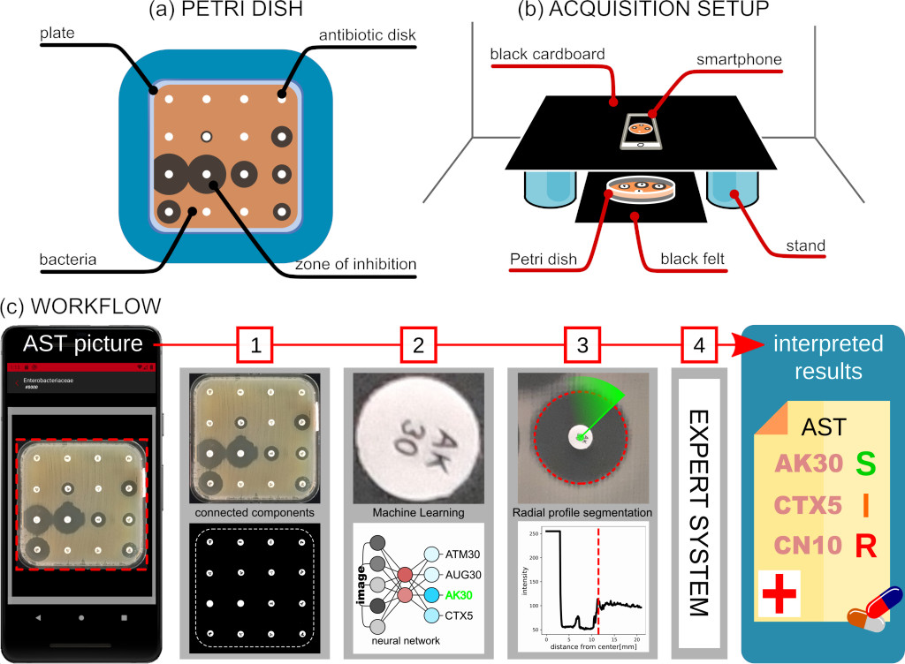

# AST image processing

## What is ASTimp?

AST image processing or _ASTimp_ is a library for processing and measuring Disk Diffusion Antibiotic Susceptibility Testing.
It allows the analysis of pictures of _disk diffusion AST_ plates and allows to measure the diameters of the inhibition zones.
For better results, the picture should be acquired according to [this simple protocol](https://mpascucci.github.io/ASTapp-protocol/)

The library is written in C++. With the included Python wrapper, it can be used in Python projects and [notebooks](ASTimp Quick Start with python.html).

This library was created for [Antibiogo](https://fondation.msf.fr/projets/antibiogo) an AST reading offline mobile application developed by a consortium of The Fundation Médecins Sans Frontières, l'[Université d'Évry](https://www.univ-evry.fr/accueil.html), le [LAMME](http://www.math-evry.cnrs.fr/doku.php), the [Hénri Mondor University Hospital](http://chu-mondor.aphp.fr/) end the [Génoscope](https://jacob.cea.fr/drf/ifrancoisjacob/Pages/Departements/Genoscope.aspx). The project won the [Google AI impact challenge 2019](https://www.blog.google/outreach-initiatives/google-org/ai-impact-challenge-grantees/). Google has been supporting and helping the development of this project untill October 2020.
An early access to the mobile application can be requested directly to the MSF Foundation with [this online form](https://form.typeform.com/to/qEGVBzbu) (for research use only).


Figure taken from _The first AI-based mobile application for antibiotic resistance testing_ by M.Pascucci et al. (2020)

## An example on Python notebooks

We have prepared a _Jupyter lab notebook_ to show ASTimp in action.
Find here the [HTML version of this notebook](ASTimp Quick Start with python.html)

The real notebook can be found in the `python module/jupyter-lab-example` source folder.


## Getting the source code

The library can be downloaded from [Github](https://github.com/mpascucci/AST-image-processing).

Use the following command command to clone the repository:
```sh
git clone https://github.com/mpascucci/AST-image-processing.git
```

## Install

**READ THE DISCLAIMER** in the project's [README.md file](https://github.com/mpascucci/AST-image-processing/blob/master/README.md#disclaimer) before installing and/or using the software. Using this software means having read and accepted the disclaimer.


If you have Docker installed in your system you can follow the [instructions for building a docker image](https://github.com/mpascucci/AST-image-processing/tree/master/docker). Otherwise, the following explains how to compile the source code.

The software has been tested on Yosemite MacOS and Ubuntu 20.10. The typical install time is 15 minutes (but may vary depending on download speed).


### Requirements
Building the library and the examples requires the following software installed on the system.
- OpenCV (>4.0.1)
- Cmake (>3.4.1)
- GTest

In Ubuntu, these dependencies correspond to the packages: `libopencv-dev`, `cmake` and `libgtest-dev`.

The Python wrapping module runs on Python3 (>3.6) and needs the openCV Python module installed (in Ubuntu the package name is `Python3-opencv`).

### Building the C++ library
Instructions for Linux/mac

Download the source code, then `cd` to the root folder `AST-image-processing`.

Either run the `run-build.sh` script which will build everything, or compile as explained hereafter.

Make a build folder, configure with `cmake` and build with `make`
```sh
mkdir build
cd build
cmake ..
make
```

You can use the just compiled `test/fullexample` application to test the library. It needs a test image as argument. For example, from the `build` folder, run it like this:
```sh
./tests/fullExample tests/test0.jpg
```
This program is expected to generate a window with the complete analysis of image `test0.jpg` and should complete this task in less than 1 second on a  computer with an intel i5 core processor.

### Installing the Python module
Instructions for Linux (tested on Ubuntu 20.10 and MacOS)

**Do not run `pip install` manually!**

Open a terminal, go into the source code root `AST-image-processing`, then run the following commands:
```sh
cd Python-module
./clean.sh
./install_astimp_Python_module.sh
```

the `clean.sh` script removes previous installation files if present.
the `isntall` script compiles the C++ library if needed and install the Python module in the current Python environment.

*NOTE ON VIRTUAL ENVIRONMENTS*: If you have installed opencv at the system level, but you are working on a virtual environment, you need to link the `cv2` module in the virtual environment library folder.
You can do this for example by running this command with the system's Python:
```sh
ln -s $(Python3 -c 'import cv2, inspect; print(inspect.getfile(cv2))') <path-to-the virtual-env>/lib/Python3.8/site-packages/
```
The `<path-to-the virtual-env>` is usually in the user's home (e.g. `~/.virtualenv/`) and can be obtained with the following command:
```sh
Python -c "import sys; print(sys.path[-1])"
```

Once the installation script terminates, one last thing is necessary: Make the system linker aware of the compiled ASTimp library. As the install scripts suggest at the end, this can be done with the command
```sh
export LD_LIBRARY_PATH=[...]/AST-image-processing/build/astimplib:$LD_LIBRARY_PATH
```

This command must be entered in each new shell where you intend to use the astimp module, otherwise could be added to the shell configuration file (e.g. `.bashrc`).

Failing to properly set this variable will result in this error:
```
Traceback (most recent call last):
  File "<string>", line 1, in <module>
ImportError: libastimp.so: cannot open shared object file: No such file or directory
```